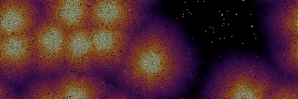

<p align="center">
  
</p>

# ABCA

**ABCA** (Agent-Based Cellular Automata) is a modular simulation framework for discrete spatial systems, ranging from classical cellular automata to biologically inspired agent-based models.

ABCA was designed as a lightweight but extensible platform for building, running, storing, and rendering discrete spatial simulations. It starts from classical cellular automata, such as Life-like rules, cyclic automata, Generations, Larger-than-Life, and weighted Life variants, but its broader ambition is to support more complex biological and physical models.

The guiding idea is simple: a model should describe how a system evolves, while the engine should take care of everything around it — simulation, reproducibility, storage, rendering, palettes, animations, and export formats.


## Why ABCA?

Cellular automata are a powerful way to explore how simple local rules can generate complex spatial patterns. They are useful not only as mathematical curiosities, but also as conceptual tools for thinking about growth, propagation, competition, self-organization, and collective behavior.

ABCA provides a common framework to explore such systems in a reproducible and extensible way.

It is intended for:

* experimenting with classical cellular automata;
* comparing families of rule-based models;
* generating visual simulations for teaching or exploration;
* prototyping spatial biological models;
* developing agent-based cellular automata;
* building reusable model plugins.


## Main features

ABCA currently provides:

* a command-line interface;
* a modular simulation core;
* support for multiple families of automata;
* rule definitions stored in external files;
* reproducible simulations through explicit random seeds;
* binary storage of complete simulation histories;
* XML export after simulation;
* PNG rendering;
* animated GIF and MP4 generation through `ffmpeg`;
* configurable color palettes;
* background color selection;
* model registration through plugins.

The current implementation already supports several classical model families, including Life-like automata, Generations, Cyclic automata, Larger-than-Life, and Weighted Life.


## Philosophy

ABCA separates concepts that are often mixed together in simulation software.

A **model** defines the states and transition rules.

A **plugin** provides a family of related models.

A **palette** maps numerical states to colors.

A **renderer** turns simulated frames into images or animations.

The **core engine** remains independent of all of these choices.

This makes it possible to run the same simulation once, save it, and later render it again with different palettes, backgrounds, frame rates, or output formats without recomputing the model.


## Documentation

- [Command-line interface](docs/command-line.md)
- [Architecture](docs/abca-structure.md)
- [Plugin API](docs/plugins.md)
- [Built-in palettes](docs/palettes.md)
- [Examples](examples/)


## Example workflow

A typical workflow is:

```bash
abca --mode run \
  --model life \
  --rows 200 \
  --cols 200 \
  --generations 1000 \
  --density 0.25 \
  --seed 42 \
  --out life.bin
```

Then render it:

```bash
abca --mode render \
  --model life \
  --input life.bin \
  --gif life.gif \
  --palette fire \
  --background white \
  --every 10 \
  --fps 30
```

The simulation and the rendering are separate steps. This makes ABCA suitable for exploratory work: one simulation can produce many visual outputs.


## Long-term goal

ABCA is being developed as a general platform for rule-based spatial simulation.

Its first layer focuses on classical automata. Its next ambition is to support biological and agent-based models, including microbial movement, filamentous growth, tissue colonization, and hybrid systems combining cellular environments with mobile agents.

In that sense, ABCA is not only a cellular automaton engine. It is intended as a small, extensible modelling framework for exploring how local rules generate spatial organization.


## Status

ABCA is currently an early-stage research and development project. The architecture is functional, but the API and file formats may still evolve.

The project is under active development.
