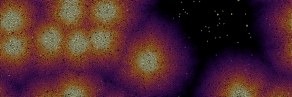

  

# ABCA

**ABCA** is a simulation engine for two-dimensional cellular automata and agent-based cellular automata.

It provides two main functions:

* running and storing simulations;
* rendering simulation outputs as images, animations, or videos.

## Plugin-based models

Simulation models are implemented as plugins located in the `plugins/` directory.

ABCA currently includes the following plugins:

### Cellular automata

* `cyclic`
* `generations`
* `larger_than_life`
* `life`
* `weighted_life`

### Agent-based cellular automata

* `zoospores`

Each plugin defines its own states, parameters, and transition rules while relying on the common ABCA simulation and rendering engine.

## Zoospore model

The `zoospores` plugin provides data-driven models of oomycete zoospore swimming.

See the plugin documentation:

* [`plugins/zoospores/README.md`](plugins/zoospores/README.md)

