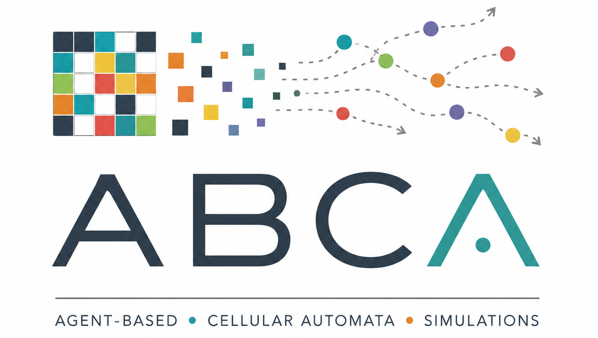

<p align="center">
  
</p>

**ABCA** is a framework for two-dimensional **cellular automata (CA)** and **agent-based cellular automata (ABCA)**.

It provides a common simulation engine together with a modular plugin system, allowing a wide range of models to share the same execution, rendering, and export pipeline. Simulations can be saved as compact binary files and rendered as images, animations, or videos.

## Installation

The empirical model assets used by the AI-derived zoospore plugins are stored using Git LFS.
Make sure Git LFS is installed before cloning the repository:

```bash
git lfs install
git clone git@github.com:EEvangelisti/ABCA.git
```

If the repository was cloned before Git LFS was installed, retrieve the large assets with:

```bash
git lfs pull
```

Compile the project with [dune](https://github.com/ocaml/dune):

```bash
dune build
```

During development, the program can be run directly without manually locating the executable:

```bash
dune exec abca -- <options>
```

The available `<options>` are defined [in this document](doc/cli.md).

## Plugins

ABCA uses a plugin architecture in which every model is implemented as an independent plugin located in the `plugins/` directory. Each plugin provides its own rules, parameters, documentation, and example simulations while relying on the common ABCA simulation and rendering engine.

The framework currently includes both classical cellular automata and agent-based cellular automata. While the former illustrate the flexibility of the engine, the latter are actively used in computational phytopathology research (e.g., to model the behaviour of *Phytophthora* zoospores from experimentally calibrated data).

The current distribution includes the following plugins:

| Plugin                                                   | Type | Description                                                                     |
| -------------------------------------------------------- | ---- | ------------------------------------------------------------------------------- |
| [`cyclic`](plugins/cyclic/README.md)                     | CA   | Cyclic cellular automata                                                        |
| [`generations`](plugins/generations/README.md)           | CA   | Multi-state Generations automata                                                |
| [`larger_than_life`](plugins/larger_than_life/README.md) | CA   | Larger-than-Life cellular automata                                              |
| [`life`](plugins/life/README.md)                         | CA   | Life-like cellular automata                                                     |
| [`weighted_life`](plugins/weighted_life/README.md)       | CA   | Weighted Life cellular automata                                                 |
| [`zoospores`](plugins/zoospores/README.md)               | ABCA | Agent-based models (ABMs) of *Phytophthora* zoospore swimming                   |
| [`zoospores_AI`](plugins/zoospores_AI/README.md)         | ABCA | AI-generated ABMs of *Phytophthora* zoospore swimming                           |


