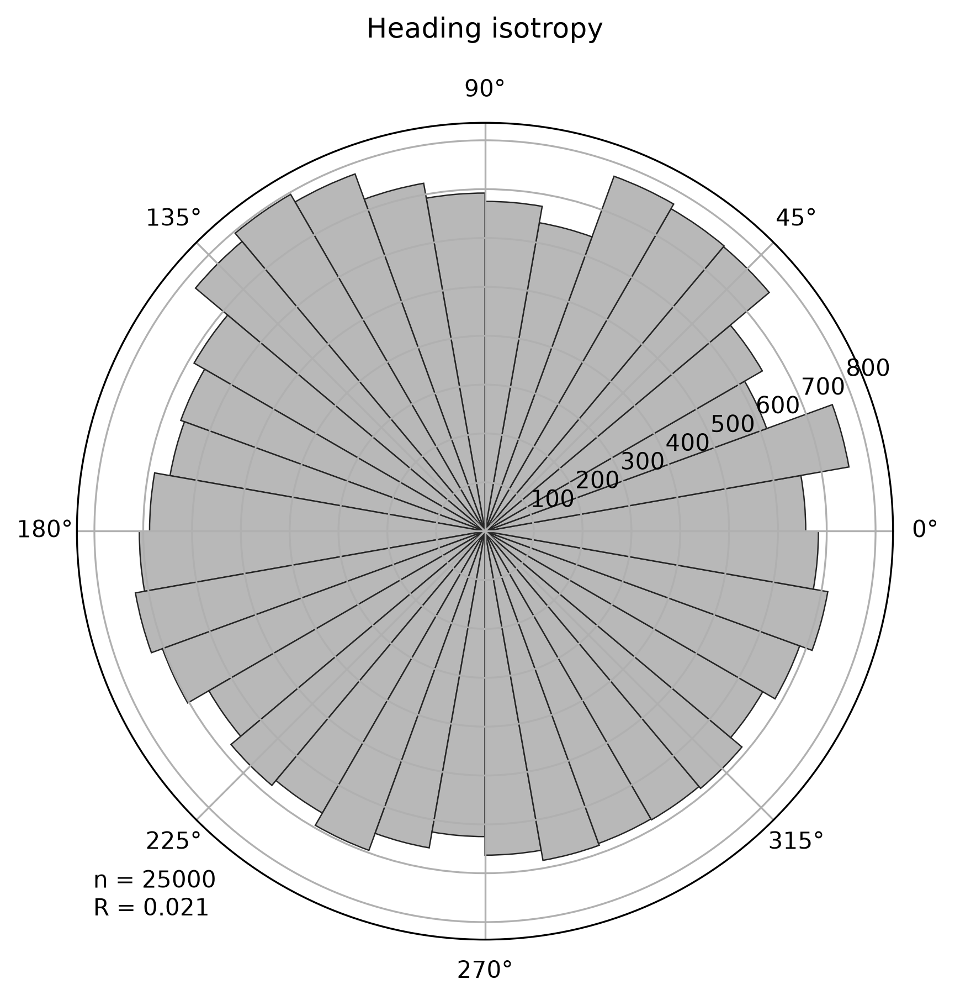
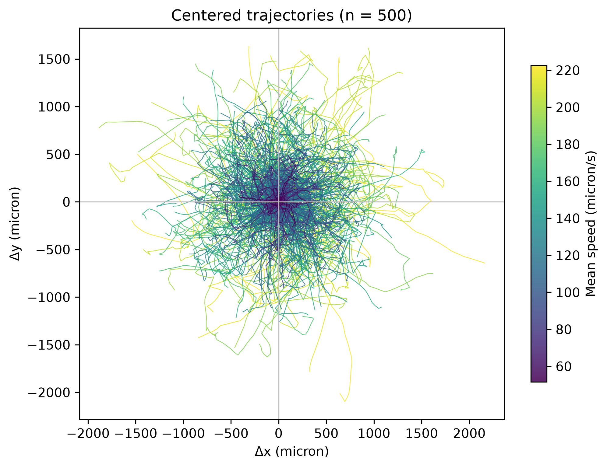

# Zoospore Model

## Overview

This plugin implements an **agent-based cellular automaton (ABCA)** describing the swimming behaviour of individual oomycete zoospores.

Unlike purely theoretical models, the current implementation is calibrated from **single-cell tracking experiments**. Local behavioural rules are inferred directly from experimental trajectories and subsequently used to simulate large populations of independent agents.

The objective is not to reproduce individual trajectories exactly, but to generate realistic population-level behaviours emerging from experimentally measured local rules.

---

## Model

Each zoospore is represented as an autonomous agent moving on a discrete lattice.

At every simulation step, each agent updates its state according to locally estimated probabilistic rules, including:

- movement versus stopping;
- swimming speed;
- turning angle;
- directional persistence.

The current implementation assumes independent agents and does not yet include interactions such as:

- chemotaxis;
- collisions;
- hydrodynamic effects;
- signalling between zoospores.

These mechanisms are intended for future versions.

---

## Experimental calibration

Model parameters are extracted from time-lapse microscopy of individual zoospores.

The current calibration includes:

- empirical distributions of swimming speeds;
- empirical turning-angle distributions;
- persistence statistics;
- Markov transition probabilities between RUN and STOP states.

Rather than fitting analytical distributions, the simulator samples directly from experimentally measured data using empirical cumulative distributions.

---

## Model validation

Several independent analyses are performed to verify that the simulated trajectories preserve key properties of the experimental data.

### Angular isotropy

The simulator should not introduce directional bias.

  

---

### Centered trajectories

Experimental and simulated trajectories can be translated so that every track starts at the origin. This visualization provides a qualitative assessment of the global exploration pattern while removing positional effects.

  

---

Additional validation metrics (speed distributions, turning statistics, persistence, MSD, autocorrelation, etc.) are currently under investigation and will be incorporated after publication.

---

## Current status

The zoospore model is under active development.

Current capabilities include:

- empirical calibration from microscopy data;
- stochastic trajectory generation;
- configurable simulation parameters;
- graphical rendering;
- export of simulated trajectories.

Several additional biological mechanisms are being implemented and validated.

---

## Citation

If you use this model, please cite the ABCA framework. Please note that a publication is currently in preparation.
