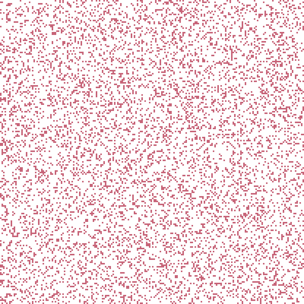

<p align="center">
  
</p>

# Generations Cellular Automata

The `generations` plugin implements **Generations cellular automata**, a family of multi-state extensions of Conway's Game of Life.

In these automata, cells progress through a sequence of intermediate states after death before becoming available for birth again. This additional memory produces a rich variety of dynamic behaviours, including waves, spirals, oscillators, and long-lived structures.

## Rule definition

Rules are defined in:

```text
plugins/generations/generations.rules
```

Each rule follows the format:

```text
AUTOMATON "<name>": <birth>/<survival>/<states>
```

where:

* **birth** lists the neighbour counts allowing a dead cell to become alive;
* **survival** lists the neighbour counts allowing a living cell to remain alive;
* **states** is the total number of cell states, including the living state and all intermediate decay states.

For example,

```text
AUTOMATON "BELZHAB": 23/23/8
```

defines a rule with:

* birth on 2 or 3 neighbours;
* survival on 2 or 3 neighbours;
* 8 cell states.

Living cells occupy state 1. Cells that do not survive progressively pass through the remaining states before returning to the quiescent state.

## Available rules

The plugin includes a collection of well-known Generations rules, including:

* BelZhab
* Brain 6
* Caterpillar
* Spirals
* Frozen Spirals
* Fireworks
* Worms
* Star Wars
* Bloomerang
* Flaming Starbows

Additional rules can be added by editing `generations.rules`; no recompilation is required.

## Initialisation

The initial configuration is generated randomly according to a user-defined density. Active cells start in the living state, while all remaining cells are initialised in the quiescent state.

## Documentation

General information about the ABCA framework is available in the repository root:

* [`README.md`](../../README.md)

