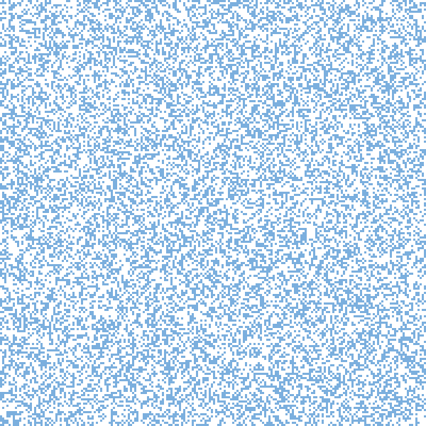

<p align="center">
  
</p>

# Larger-than-Life Cellular Automata

The `larger_than_life` plugin implements **Larger-than-Life (LtL)** cellular automata, a generalisation of Conway's Game of Life introduced by Kellie Evans.

Instead of considering only the eight neighbouring cells of the Moore neighbourhood, Larger-than-Life rules operate over neighbourhoods of arbitrary radius. This simple extension gives rise to remarkably rich behaviours, including large-scale waves, oscillators, self-organising domains, and moving structures.

## Rule definition

Rules are defined in:

```text
plugins/larger_than_life/larger_than_life.rules
```

Each rule follows the format:

```text
AUTOMATON "<name>": <radius> <include_center> S<survival> B<birth>
```

where:

* **radius** is the Moore neighbourhood radius;
* **include_center** indicates whether the central cell contributes to the neighbourhood count (`true` or `false`);
* **S** specifies the neighbour counts allowing a living cell to survive;
* **B** specifies the neighbour counts allowing a dead cell to become alive.

For example,

```text
AUTOMATON "BUGS": 5 true S34..58 B34..45
```

defines a Larger-than-Life automaton with:

* neighbourhood radius = 5;
* the central cell included in neighbour counting;
* survival for neighbour counts between 34 and 58;
* birth for neighbour counts between 34 and 45.

## Available rules

The plugin currently provides the following predefined rules:

* Majority
* Bugs
* Bugs Movie
* Modern Art
* Waffle
* Globe

Additional rules can be added by editing `larger_than_life.rules`; no recompilation is required.

## Initialisation

The initial configuration is generated randomly according to a user-defined density. Cells are initialised in either the living or dead state.

## Documentation

General information about the ABCA framework is available in the repository root:

* [`README.md`](../../README.md)

