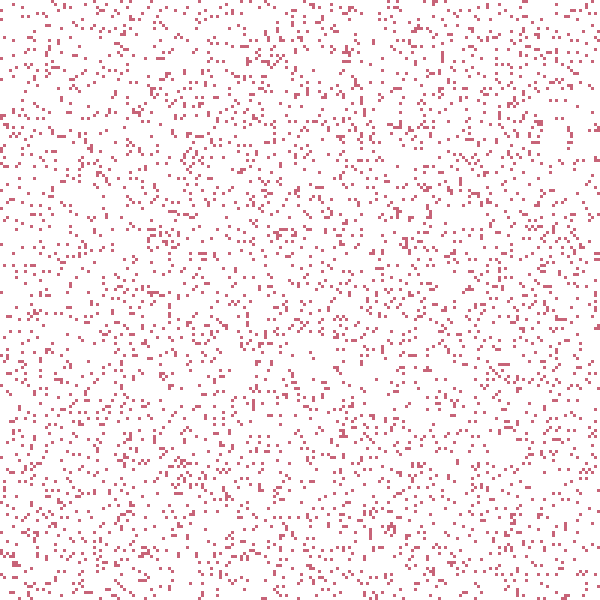

<p align="center">
  
</p>

# Life-like Cellular Automata

The `life` plugin implements **Life-like cellular automata**, a family of binary cellular automata derived from Conway’s Game of Life.

Each cell is either dead or alive. At every generation, its next state depends on the number of living cells in its Moore neighbourhood. Different birth and survival conditions produce a wide range of behaviours, including stable structures, oscillators, moving patterns, replicators, mazes, and chaotic growth.

## Rule definition

Rules are defined in:

```text
plugins/life/life.rules
```

Each rule follows the format:

```text
AUTOMATON "<name>": <survival>/<birth>
```

where:

* **survival** lists the neighbour counts allowing a living cell to survive;
* **birth** lists the neighbour counts allowing a dead cell to become alive.

For example,

```text
AUTOMATON "LIFE": 23/3
```

defines Conway’s Game of Life:

* a living cell survives with 2 or 3 living neighbours;
* a dead cell becomes alive with exactly 3 living neighbours.

## Available rules

The plugin currently includes:

* Life
* Life 34
* 2x2
* Gnarl
* Flakes
* Assimilation
* Amoeba
* Diamoeba
* Coral
* Maze
* Mice
* Move
* Walled Cities
* Stains
* Coagulations
* Mazectric
* Serviettes
* Day and Night
* Replicator
* Pseudo Life
* High Life
* Inverse Life

Additional rules can be added by editing `life.rules`; no recompilation is required.

## Initialisation

The initial configuration is generated randomly according to a user-defined density. Cells are initialised as either alive or dead.

## Documentation

General information about the ABCA framework is available in the repository root:

* [`README.md`](../../README.md)

