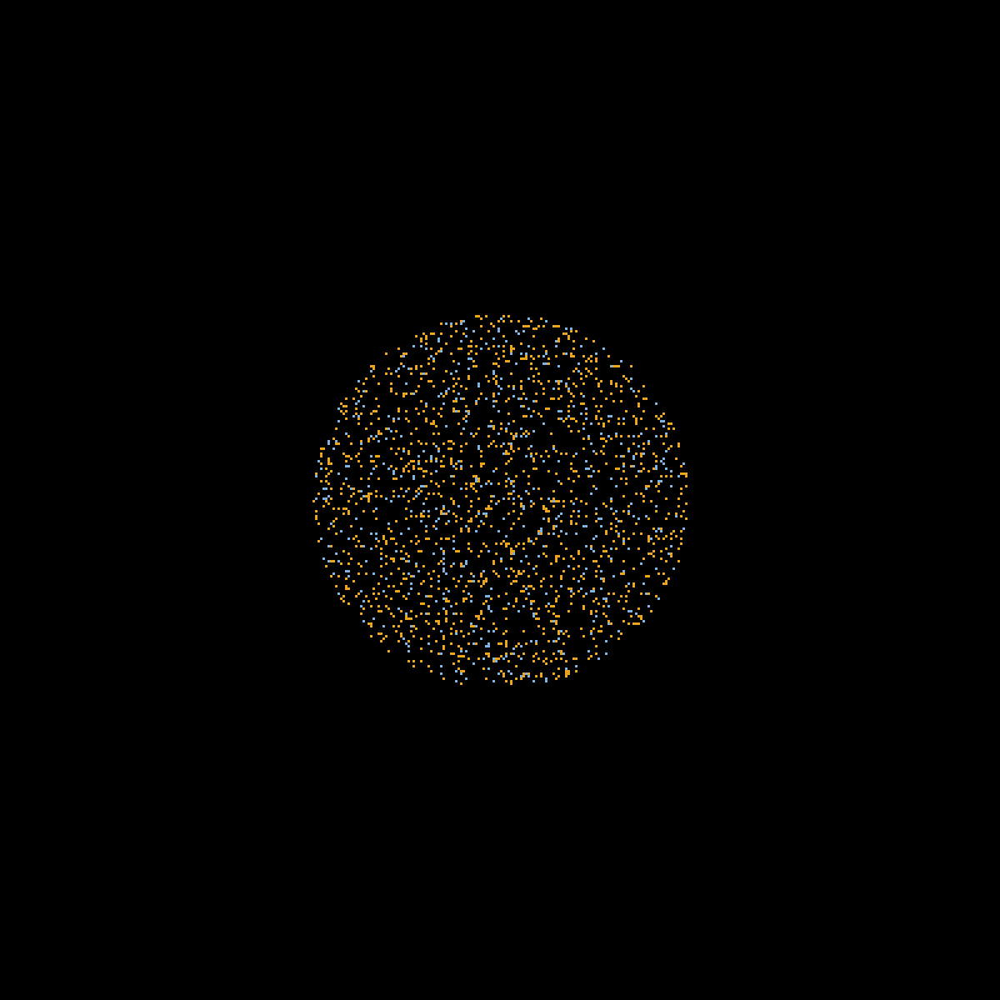

← **[Back to ABCA documentation](../../README.md)**

---

# Modelling Zoospore Swimming Behaviour

This repository provides two behavioural models of zoospore swimming calibrated 
from nearly 60,000 experimentally reconstructed trajectories of 
*Phytophthora nicotianae* zoospores freely exploring a liquid environment. 
The models comprise an empirical SLOW/FAST model and a hidden Markov model 
(HMM), which can be directly used with the ABCA simulation framework.

To facilitate the development of new behavioural models, the complete analysis 
workflow used for model calibration is also provided. It includes image 
preprocessing, automated trajectory reconstruction, quantitative trajectory 
analysis, empirical parameter extraction, and HMM inference, allowing users 
to infer equivalent models from their own time-lapse microscopy datasets.

  

## Available models

Two complementary behavioural models are currently provided.

- **Empirical SLOW/FAST model**: a two-state empirical model describing 
alternating SLOW and FAST swimming phases. Its parameters were estimated 
directly from experimentally reconstructed trajectories and exported for use 
with the ABCA simulation framework.

- **Two-state hidden Markov model (HMM)**: a probabilistic model inferred 
independently from the same trajectory dataset. It provides an alternative 
statistical description of zoospore behaviour and serves both to refine the 
biological interpretation of swimming states and to independently validate 
the empirical SLOW/FAST model.

## Examples

The following files illustrate how to run simulations.

| File                                                                | Description                                     |
| ------------------------------------------------------------------- | ----------------------------------------------- |
| [`empirical.sh`](examples/empirical.sh)                             | Example of simulation using the empirical model |
| [`batch_empirical.sh`](examples/batch_empirical.sh)                 | Same as above, but for batch processing         |
| [`hmm.sh`](examples/hmm.sh)                                         | Example of simulation using the two-state HMM   |
| [`batch_hmm.sh`](examples/batch_hmm.sh)                             | Same as above, but for batch processing         |
| [`P_nicotianae_empirical.gif`](examples/P_nicotianae_empirical.gif) | Zoospore simulation using the empirical model   |
| [`P_nicotianae_hmm.gif`](examples/P_nicotianae_hmm.gif)             | Zoospore simulation using the two-state HMM     |

## Workflow for building new behavioural models

A typical analysis workflow consists of three stages: trajectory analysis, 
model fitting, and model validation. Before running the analysis pipeline, 
[set up the Python environment](setup/README.md). This environment is shared by 
all scripts and ensures isolated, reproducible execution. For convenience, a 
[`run_all.sh`](run_all.sh) script is provided to automate the complete workflow. 
Nevertheless, users are encouraged to review and adjust the configuration files 
associated with each analysis step before launching the pipeline.

> [!IMPORTANT]
> **Directory layout.** The analysis pipeline is designed around a fixed 
directory layout in which all analysis modules are organised as sibling 
directories within a common parent directory. The relative paths used 
throughout the configuration files, shell wrappers, and the `run_all.sh` 
script assume this layout. Modifying the directory structure is not recommended. 
If you do so, the relative paths defined throughout the configuration files, 
shell wrappers, and `run_all.sh` must be updated accordingly.

> [!NOTE]
> **Before you begin.** Trajectories are typically reconstructed from time-lapse 
microscopy image series using ImageJ/Fiji together with a dedicated 
particle-tracking plugin such as [TrackMate](https://imagej.net/plugins/trackmate/).
A typical reconstruction workflow consists of:
>1. **Image preprocessing**, including operations such as background subtraction, 
size filtering, noise reduction, and image enhancement.
>2. **Particle detection**, in which individual zoospores are identified in each 
frame.
>3. **Trajectory reconstruction**, where detections are linked across successive 
frames to generate complete trajectories.
>**The analysis workflow provided in this repository starts from the reconstructed trajectories produced by this process.**

### Trajectory analysis

These modules extract quantitative descriptors from reconstructed trajectories 
and generate the figures and summary statistics used to characterise zoospore 
swimming behaviour.

- [Extracting trajectory metrics](trajectory_analysis/metrics_extraction/README.md)
- [Analysing trajectory metrics](trajectory_analysis/metrics_analysis/README.md)
- [Plotting trajectory overviews](trajectory_analysis/plotting_overviews/README.md)

### Model fitting

These modules infer empirical and Hidden Markov behavioural models directly 
from the experimental data, producing parameter sets compatible with the ABCA 
simulation framework.

- [Analysing SLOW/FAST hysteresis](model_fitting/hysteresis/README.md)
- [Extracting empirical model parameters](model_fitting/local_parameter_extraction/README.md)
- [Fitting hidden Markov models](model_fitting/hmm_model_fit/README.md)

At this stage, you can run simulations using your own input files. For examples of Bash scripts, see above.

### Model validation

These modules compare simulated and experimental trajectories after controlling 
for differences in trajectory length, allowing quantitative validation of 
simulation outputs.

- [Resampling trajectories](model_validation/trajectory_resampling/README.md)
- [Validating simulations using global metrics](model_validation/simulation_validation/README.md)

Predictive validation can then be performed by applying the same workflow to 
independent experimental datasets and comparing the resulting simulations with 
the corresponding observations.

---

← **[Back to ABCA documentation](../../README.md)**
